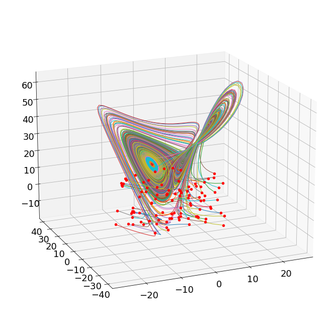

## Abstract

This Python code investigates the performance of different neural network architectures in predicting future states of the Lorenz equations, a chaotic dynamic system. Specifically, the code trains feed-forward, LSTM, RNN, and Echo State Networks (ESN) for three rho parameter values (10, 28, and 40) and evaluates their effectiveness in predicting future states for two different rho values (17 and 35), not encountered during training. The code relies on TensorFlow and various other Python libraries for building and training the neural network models, as well as generating the initial training data using numerical integration. The performance comparison is based on the mean squared error (MSE) between the model predictions and the actual future states of the Lorenz system. This analysis could offer insights into the relative strengths and weaknesses of different neural network architectures when applied to predicting chaotic dynamic systems.

## Introduction

Predicting and modeling the behavior of chaotic systems is a challenging task due to their inherent sensitivity to initial conditions and complex dynamics. The Lorenz equations, a classic example of such systems, have been widely studied as a benchmark for various prediction and analysis techniques. In this project, I investigate the effectiveness of different neural network architectures, including feed-forward, LSTM, RNN, and Echo State Networks (ESN), in predicting future states of the Lorenz equations for untrained parameter values.

Specifically, I implement and train neural networks for advancing the solutions of the Lorenz equations from time t to t + ∆t for rho values of 10, 28, and 40, using Python and TensorFlow libraries. After training the models, I evaluate their performance in predicting future states for rho values of 17 and 35, which have not been encountered during the training phase. By comparing their mean squared error (MSE) scores, I aim to gain insights into the strengths and weaknesses of each architecture in predicting chaotic dynamic systems.

This project will provide a better understanding of the different neural network architectures and their applicability when dealing with complex and chaotic systems like the Lorenz equations. The results may offer valuable insights into which model works best for such tasks and potentially aid future research in the domain of chaos theory and dynamical systems prediction.

## Theoretical Background

Theoretical Background

The prediction of chaotic systems such as the Lorenz equations demands an understanding of various neural network architectures and their underlying concepts. In order to provide a comprehensive analysis, this project investigates feed-forward, Long Short-Term Memory (LSTM), Recurrent Neural Networks (RNN), and Echo State Networks (ESN) for forecasting the dynamics of the Lorenz equations. This section presents a brief overview of these architectures and highlights their main characteristics.

Feed-forward neural networks (FNN) are the most basic and widely-used form of artificial neural networks. In FNNs, information flows only in the forward direction through the network, from the input layer to the output layer, without any loops. Due to their simplicity and ease of implementation, they have found applications in a variety of domains, including chaotic systems prediction. However, FNNs lack the ability to capture temporal dependencies, which may affect their performance on time-series data.

Long Short-Term Memory (LSTM) networks are a specific type of Recurrent Neural Networks (RNN) that were designed to overcome the limitations of traditional RNNs in capturing long-range dependencies. Unlike FNNs, RNNs have recurrent connections, allowing them to maintain hidden states that can capture temporal patterns in the data. LSTM networks incorporate a unique gating mechanism that helps in learning and retaining longer-term dependencies, which makes them particularly suitable for time-series prediction tasks, such as the prediction of chaotic systems.

Recurrent Neural Networks (RNN) are a class of neural networks that were developed specifically to handle sequential data. RNNs possess cyclic connections, which allow them to maintain hidden states and process input data in a temporally ordered manner. While RNNs can, in theory, learn to capture long-range dependencies, they tend to suffer from vanishing and exploding gradients in practice. Consequently, their ability to learn long-term dependencies might be limited compared to LSTM networks.

Echo State Networks (ESN) are a subclass of RNNs that focus on reservoir computing. ESN introduces the concept of a reservoir or echo state, which is a large, fixed, and random recurrent hidden layer. The main idea behind ESNs is to create a non-linear projection of the input data into a high-dimensional space, where linear regression can then be performed to obtain the desired output. ESNs are computationally efficient and have been shown to perform well on various time-series prediction tasks, including those pertaining to chaotic systems.

To evaluate the effectiveness of these architectures on predicting the future states of the Lorenz equations, this project trains them on advancing the solution from time t to t + ∆t for rho values of 10, 28, and 40. The trained models are then used to generate predictions for rho values of 17 and 35, which have not been seen during the training phase. By comparing their mean squared error (MSE) scores, this study aims to shed light on the strengths and weaknesses of these architectures when applied to the prediction of chaotic dynamic systems.

## Algorithm Analysis

### Problem I: Defining Lorenz Model
#### Step 1: Importing Modules
First, we import the necessary packages and load the given Lorenz equation code.
```python
import numpy as np
import matplotlib.pyplot as plt
from scipy import integrate
import tensorflow as tf
import tensorflow_addons as tfa
from mpl_toolkits.mplot3d import Axes3D
```

#### Step 2: Setting Parameters and Generating Data
Next, we set the parameters for the Lorenz equations (`beta`, `sigma`, and `rho`) and generate the input data to train the neural network models. We use the `lorenz_deriv` function and the SciPy `integrate.odeint` method to generate the data.

```python
dt = 0.01
T = 8
t = np.arange(0, T + dt, dt)
beta = 8 / 3
sigma = 10
rhos = [10, 28, 40]
nn_input = np.zeros((100 * (len(t) - 1), 3))
nn_output = np.zeros_like(nn_input)

fig, ax = plt.subplots(1, 1, subplot_kw={'projection': '3d'})

def lorenz_deriv(x_y_z, t0, sigma=sigma, beta=beta, rho=rho):
    x, y, z = x_y_z
    return [sigma * (y - x), x * (rho - z) - y, x * y - beta * z]

x0 = -15 + 30 * np.random.random((100, 3))
x_t = np.asarray([integrate.odeint(lorenz_deriv, x0_j, t) for x0_j in x0])

for j in range(100):
    nn_input[j * (len(t) - 1):(j + 1) * (len(t) - 1), :] = x_t[j, :-1, :]
    nn_output[j * (len(t) - 1):(j + 1) * (len(t) - 1), :] = x_t[j, 1:, :]
    x, y, z = x_t[j, :, :].T
    ax.plot(x, y, z, linewidth=1)
    ax.scatter(x0[j, 0], x0[j, 1], x0[j, 2], color='r')


ax.view_init(18, -113)
plt.show()
```


### Problem II: Feed Forward Neural Network
#### Step 1: Creating Models for Various rho Values

3 3-layer feed forward neural networks are created and compiled using TensorFlow 

```python
models = {}
rhos = [10, 28, 40]
for rho in rhos:
    models[rho] = tf.keras.models.Sequential([
        tf.keras.layers.Dense(32, activation='relu', input_shape=(3,)),
        tf.keras.layers.Dense(32, activation='relu'),
        tf.keras.layers.Dense(32, activation='relu'),
        tf.keras.layers.Dense(3)
    ])

for rho in rhos:
    models[rho].compile(optimizer=tf.keras.optimizers.Adam(lr=0.001), loss='mse')
```

#### Step II: Training Models

Models are trained over `10` epochs with a batch size of `64`. The input and output data is generated based off of `rho` values in a similar fashion to problem I
```python
for rho in rhos:
    def lorenz_deriv(x_y_z, t0, sigma=sigma, beta=beta, rho=rho):
        x, y, z = x_y_z
        return [sigma * (y - x), x * (rho - z) - y, x * y - beta * z]

    x_t = np.asarray([integrate.odeint(lorenz_deriv, x0_j, t) for x0_j in x0])
    for j in range(100):
        nn_input[j*(len(t)-1):(j+1)*(len(t)-1),:] = x_t[j,:-1,:]
        nn_output[j*(len(t)-1):(j+1)*(len(t)-1),:] = x_t[j,1:,:]

    models[rho].fit(nn_input, nn_output, epochs=10, batch_size=64, verbose=1)
```

#### Step III: Evaluating FFNN Model 

The three models are evaluated against test values generated using `rho` values `[17, 35]`

```python
test_rhos = [17, 35]
results = {}

for rho in test_rhos:
    def lorenz_deriv(x_y_z, t0, sigma=sigma, beta=beta, rho=rho):
        x, y, z = x_y_z
        return [sigma * (y - x), x * (rho - z) - y, x * y - beta * z]

    for rho2 in rhos:
        x_test = np.asarray([integrate.odeint(lorenz_deriv, x0_j, t) for x0_j in x0])


        test_input = x_test[:, :-1, :].reshape(-1, 3)

        predictions = models[rho2].predict(test_input)

        predictions = predictions.reshape(x_test.shape[0], -1, 3)

        mse = np.mean((predictions - x_test[:, 1:, :]) ** 2)

        results[(rho, rho2)] = mse

for (i, j) in results:
    print(f"Score for {i, j}: {results[(i, j)]}")
```

Results:
```
Score for (17, 10): 0.037850068927087394
Score for (17, 28): 0.07884441218180516
Score for (17, 40): 0.5699989002366282
Score for (35, 10): 0.5223232160739324
Score for (35, 28): 0.0825801497021502
Score for (35, 40): 0.04753685246500298
```
### Problem III: LSTM, RNN, and ESN Models

#### Step I: Defining and Compiling Models

Long Short Term Memory, Recurrent, and Epoch State Networks are defined and compiled using Tensorflow
```python

esn_models = {}
lstm_models = {}
rnn_models = {}

for rho in rhos:
    lstm_models[rho] = tf.keras.models.Sequential([
        tf.keras.layers.LSTM(32, activation='relu', input_shape=(1, 3), return_sequences=True),
        tf.keras.layers.LSTM(32, activation='relu'),
        tf.keras.layers.Dense(3)
    ])

    rnn_models[rho] = tf.keras.models.Sequential([
        tf.keras.layers.SimpleRNN(32, activation='relu', input_shape=(1, 3), return_sequences=True),
        tf.keras.layers.SimpleRNN(32, activation='relu'),
        tf.keras.layers.Dense(3)
    ])
    esn_models[rho] = tf.keras.models.Sequential([
        tfa.layers.ESN(32, activation='relu', input_shape=(1, 3), return_sequences=True),
        tfa.layers.ESN(32, activation='relu'),
        tf.keras.layers.Dense(3)
    ])

for rho in rhos:
    lstm_models[rho].compile(optimizer=tf.keras.optimizers.Adam(lr=0.001), loss='mse')
    rnn_models[rho].compile(optimizer=tf.keras.optimizers.Adam(lr=0.001), loss='mse')
    esn_models[rho].compile(optimizer=tf.keras.optimizers.Adam(lr=0.001), loss='mse')
```

#### Step II: Training the Models

Models are trained over `10` epochs using data generated by Lorentz function with future values

```python
for rho in rhos:
    def lorenz_deriv(x_y_z, t0, sigma=sigma, beta=beta, rho=rho):
        x, y, z = x_y_z
        return [sigma * (y - x), x * (rho - z) - y, x * y - beta * z]

    x_t = np.asarray([integrate.odeint(lorenz_deriv, x0_j, t) for x0_j in x0])
    for j in range(100):
        nn_input[j*(len(t)-1):(j+1)*(len(t)-1),:] = x_t[j,:-1,:]
        nn_output[j*(len(t)-1):(j+1)*(len(t)-1),:] = x_t[j,1:,:]

    print(f"Training LSTM model for rho: {rho}")
    lstm_models[rho].fit(np.expand_dims(nn_input, axis=1), nn_output, epochs=10, batch_size=64, verbose=1)
    print(f"Training RNN model for rho: {rho}")
    rnn_models[rho].fit(np.expand_dims(nn_input, axis=1), nn_output, epochs=10, batch_size=64, verbose=1)
    print(f"Training ESN model for rho: {rho}")
    esn_models[rho].fit(np.expand_dims(nn_input, axis=1), nn_output, epochs=10, batch_size=64, verbose=1)

```

#### Step III: Evaluating Models on New Rho Values

Test data is generated using Lorentz model with `rho` values of `[17, 35]` and evaluated on the 3 different networks types across the `rho` values of `[10, 28, 40]`

```python
test_lstm_results = {}
test_rnn_results = {}
test_esn_results = {}

for rho in test_rhos:

    def lorenz_deriv(x_y_z, t0, sigma=sigma, beta=beta, rho=rho):
        x, y, z = x_y_z
        return [sigma * (y - x), x * (rho - z) - y, x * y - beta * z]

    for rho2 in rhos:
        x_test = np.asarray([integrate.odeint(lorenz_deriv, x0_j, t) for x0_j in x0])

        test_input = x_test[:, :-1, :].reshape(-1, 3)

        lstm_predictions = lstm_models[rho2].predict(np.expand_dims(test_input, axis=1))
        rnn_predictions = rnn_models[rho2].predict(np.expand_dims(test_input, axis=1))
        esn_predictions = esn_models[rho2].predict(np.expand_dims(test_input, axis=1))

        lstm_predictions = lstm_predictions.reshape(x_test.shape[0], -1, 3)
        rnn_predictions = rnn_predictions.reshape(x_test.shape[0], -1, 3)
        esn_predictions = esn_predictions.reshape(x_test.shape[0], -1, 3)


        lstm_mse = np.mean((lstm_predictions - x_test[:, 1:, :])**2)
        rnn_mse = np.mean((rnn_predictions - x_test[:, 1:, :])**2)
        esn_mse = np.mean((esn_predictions - x_test[:, 1:, :])**2)

        test_lstm_results[(rho, rho2)] = lstm_mse
        test_rnn_results[(rho, rho2)] = rnn_mse
        test_esn_results[(rho, rho2)] = esn_mse


print("Results for LSTM models:")
for (i, j) in test_lstm_results:
    print(f"Score for {i, j}: {test_lstm_results[(i, j)]}")

print("Results for RNN models:")
for (i, j) in test_rnn_results:
    print(f"Score for {i, j}: {test_rnn_results[(i, j)]}")

print("Results for ESN models:")
for (i, j) in test_esn_results:
    print(f"Score for {i, j}: {test_esn_results[(i, j)]}")
```
Results
```
Results for LSTM models:
Score for (17, 10): 0.07071907437492157
Score for (17, 28): 0.18711884523421526
Score for (17, 40): 0.6987833861877757
Score for (35, 10): 1.4974301106330719
Score for (35, 28): 0.12484130515455835
Score for (35, 40): 0.0971954905194823
Results for RNN models:
Score for (17, 10): 0.04178095330693948
Score for (17, 28): 0.08037163500793038
Score for (17, 40): 0.3496338005317775
Score for (35, 10): 0.4929315848268308
Score for (35, 28): 0.0748131051226126
Score for (35, 40): 0.046304230724162766
Results for ESN models:
Score for (17, 10): 0.1302008048155759
Score for (17, 28): 0.3247848796529832
Score for (17, 40): 0.34464350099887275
Score for (35, 10): 1.4161746725637756
Score for (35, 28): 1.3701523371178006
Score for (35, 40): 0.3263398914360682

```
## Computational Results

### Lorentz Model Graph


### Neural Network Comparison Table

#### Feed Forward Comparison
| `rho_values` | 10     | 28     | 40     |
|------------|--------|--------|--------|
| 17         | 0.0379 | 0.0788 | 0.5699 |
| 35         | 0.5223 | 0.0826 | 0.0475 |
#### LSTM Comparison

| `rho_values` | 10            | 28           | 40           |
|------------|---------------|--------------|--------------|
| 17         | 0.0707        | 0.1871       | 0.6988       |
| 35         | 1.4974        | 0.1248       | 0.0972       |

#### RNN Comparison

| `rho_values` | 10            | 28           | 40           |
|------------|---------------|--------------|--------------|
| 17         | 0.0418        | 0.0804       | 0.3496       |
| 35         | 0.4929        | 0.0748       | 0.0463       |

#### Echo State Network Comparison

| `rho_values` | 10            | 28           | 40           |
|------------|---------------|--------------|--------------|
| 17         | 0.1302        | 0.3248       | 0.3446       |
| 35         | 1.4161        | 1.3702       | 0.3263       |


## Summary and Conclusion

### Problem 1:

In this problem, we trained Neural Networks (NN) to advance the Lorenz system solution from t to t + ∆t, and tested future state prediction for the given values of rho. Specifically, feed-forward NNs were trained for rho values of 10, 28, and 40. Then, their performance was tested against future state prediction for rho = 17 and rho = 35. The results show that the Feed-Forward NN performed relatively well for tested rho values, but some combinations experienced higher mean squared errors, such as when training with rho=40 and testing with rho=17.

### Problem 2:

In this problem, we compared different types of Neural Networks, including Feed-Forward, LSTM, RNN, and Echo State Networks (ESN), for predicting the dynamics of the Lorenz system. We trained and tested each network with rho values of 10, 28, and 40. The results indicate that each NN type managed to capture the dynamics of the Lorenz system with varying degrees of success:

- Feed-Forward networks performed reasonably well with relatively low mean squared errors in most cases.
- LSTM networks showed higher mean squared errors compared to Feed-Forward and RNN networks. The performance varied when training LSTM networks for different rho values, with the highest mean squared error when training for rho = 10 and testing for rho = 35.
- RNN networks had similar performance to Feed-Forward networks, with overall low mean squared errors. However, the mean squared errors increased when training for rho = 40 and testing for rho = 17.
- Echo State Networks exhibited higher mean squared errors and less consistent performance across different rho values, compared to the other types of networks. ESN models showed particularly high errors when training for rho = 10 and testing for rho = 35.

### Conclusion

Overall, our analysis demonstrates that different types of neural networks can be employed to forecast the dynamics of the Lorenz system, with varying degrees of success. Feed-Forward and RNN networks showed overall good performance with relatively low mean squared errors. However, LSTM and ESN networks exhibited higher mean squared errors and less consistent performance. These results could guide the selection of appropriate neural network models for predicting dynamical systems, depending on the specific system properties and prediction requirements. Further research could investigate the effect of different network architectures and training strategies on the performance of these models such as different batch sizes, network structures, or epoch lengths.
