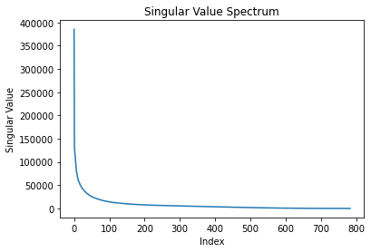
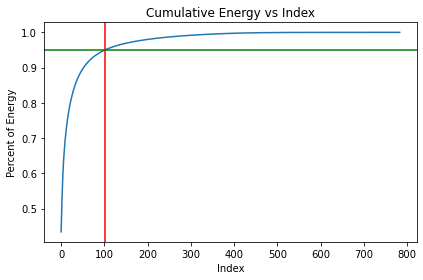
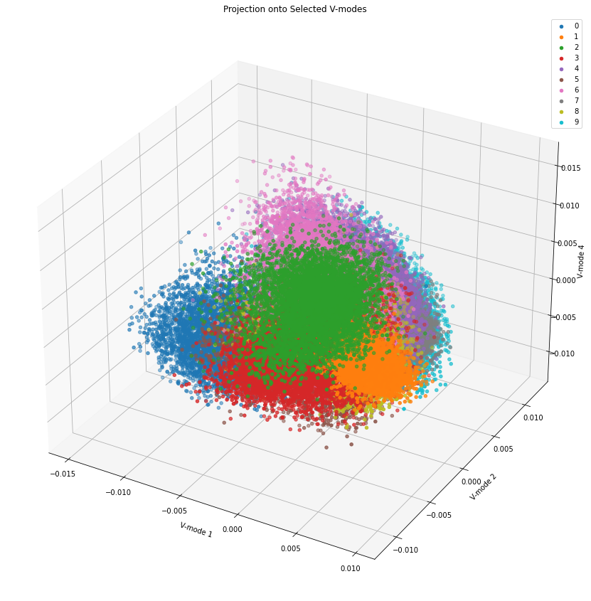

# Homework III: Exploring MNIST: Support Vector Machines, Linear Discriminant Analysis, Principal Component Analysis, Singular Value Decomposition, and Decision Tree Classifiers

#### Author: Joe Leuschen

## Abstract

This Python code analyzes the MNIST dataset, consisting of 70,000 images of handwritten digits, through Singular Value Decomposition (SVD), Linear Discriminant Analysis (LDA), Support Vector Machines (SVM), and Decision Tree classification techniques. The analyzed dataset was projected onto a selected PCA space, and a classifier was built to identify individual digits in the training set. The SVD analysis helped determine the rank necessary for good image reconstruction and provided interpretations for the U, Σ, and V matrices. The code also compared the performance of LDA, SVM, and decision trees on the hardest and easiest pairs of digits to separate. The results of this analysis can be used for dimensionality reduction or classification in applications such as image compression, reconstruction, and recognition systems.

## Introduction

In this project, I analyze the MNIST dataset, a widely-used benchmark for machine learning algorithms containing 70,000 images of handwritten digits (0-9). The primary goal is to perform an analysis using Singular Value Decomposition (SVD) to gain insights into the underlying structure of the dataset and to explore the possibility of building classifiers to identify individual digits in the training set efficiently. 

The analysis begins with executing an SVD analysis of the digit images, examining the singular value spectrum, determining the rank required for good image reconstruction, and understanding the interpretation of the resulting U, Σ, and V matrices. Additionally, I project the images onto selected V-modes and create a 3D plot to visualize the distribution of these images in PCA space categorized by their digit labels. This visualization aids in identifying separable digit clusters in lower-dimensional space which could exhibit valuable patterns for dimensionality reduction or classification.

Following the SVD analysis, I investigate the construction of linear classifiers such as Linear Discriminant Analysis (LDA), Support Vector Machines (SVM), and Decision Trees to distinguish multiple digit combinations. I then assess the performance of these classifiers on the hardest and easiest pairs of digits and compare the accuracy scores on training and test datasets.

By conducting this project, I aim to develop a deeper understanding of the MNIST dataset and its potential applications in image classification, as well as gain valuable experience in implementing SVD and various machine learning techniques on real-world data.

## Theoretical Background

Singular Value Decomposition (SVD) is a core technique for this analysis, enabling the decomposition of a matrix into constituent matrices (U, Σ, and V) that encapsulate essential information about the original dataset. With respect to the MNIST dataset, SVD allows for a compact and descriptive representation of the image data. By selecting the optimal rank for image reconstruction, the significant modes or basis images can be represented in a lower-dimensional space, preserving the majority of the relevant information.

Analyzing the singular value spectrum illuminates the number of modes necessary for good image reconstruction. This is essential not only for approximating the relevant images but also discerning the adequate amount of principal components to maintain for efficient computation and classification processes.

The U (basis images), Σ (singular values), and V matrices obtained from SVD provide valuable insights into the dataset. The U matrix manifests as eigenimages, revealing the primary directions of variance in the data, whereas the Σ matrix highlights the relative importance of each mode. The V matrix is instrumental in reconstructing the original images using the learned eigenvector bases.

Projection of data onto selected V-modes in a 3D plot allows visualization of the distribution of images in the PCA subspace, separated by digit labels. Based on this projection, the exploration of linear classification methods such as Linear Discriminant Analysis (LDA), Support Vector Machines (SVM), and Decision Tree Classifiers is conducted to classify digit pairs with varying levels of separability.

Linear Discriminant Analysis (LDA) is a supervised learning method that classifies instances by maximizing the between-class variance while minimizing the within-class variance in the labeled data. Support Vector Machines (SVM) classify instances by constructing optimal hyperplanes that maximize the margin between different classes in the feature space. Meanwhile, Decision Trees recursively split the input space based on feature values to form a structured flowchart-like representation of the decision-making process.

## Algorithm Analysis

### Importing modules and loading in the data

```python
from sklearn.datasets import fetch_openml
from sklearn.model_selection import train_test_split
from sklearn.svm import SVC
from sklearn.metrics import accuracy_score
from matplotlib import pyplot as plt
from keras.datasets import mnist
import numpy as np
from mpl_toolkits.mplot3d import Axes3D
from sklearn.discriminant_analysis import LinearDiscriminantAnalysis as LDA
from sklearn.tree import DecisionTreeClassifier
from sklearn.svm import SVC
```

### Problem I: SVD Analysis of the digit images

Reshaping each image into a column vector and creating numpy arrays with digit images

```python
(X_train, y_train), (X_test, y_test) = mnist.load_data()
X_train = X_train.reshape(60000, 784).T
X_test = X_test.reshape(10000, 784).T
```

Performing SVD (Singular Value Decomposition)

```python
U, S, V = np.linalg.svd(X_train, full_matrices=False)
```

Checking the Singular Value Spectrum

```python
plt.plot(S)
plt.title("Singular Value Spectrum")
plt.xlabel("Index")
plt.ylabel("Singular Value")
plt.show()
```



Calculating the rank `r` of the digit space with 95% of energy

```python
cumEnergy = np.cumsum(S**2) / np.sum(S**2)
cutoff = 0.95
rank = np.where(cumEnergy >= cutoff)[0][0]
```

From the analysis, we can see that the rank of the digit space is 102, which means we need only 102 modes for a good image reconstruction while capturing 95% of the total energy.


Plotting Cumulative Energy

```python
plt.plot(cumEnergy)
plt.xlabel("Index")
plt.ylabel("Percent of Energy")
plt.title("Cumulative Energy vs Index")
plt.axvline(102, c='r')
plt.axhline(0.95, c='g')
plt.tight_layout()
```




### Problem II: Interpretation of U, Σ, and V matrices and PCA visualization

**U Matrix**: The columns of the U matrix represent the 'eigenimages' or the basis images. These basis images can be combined with varying weights to produce an approximation of the images in the dataset.

**Σ Matrix**: The Σ matrix contains the singular values, which represent the relative importance of each mode in the reconstruction of the images in the dataset. The larger the singular value, the more important the corresponding mode is in capturing the important features of the data.

**V Matrix**: The V matrix contains information about the weights of the basis images (U) needed to reconstruct the images in the dataset. Each column of V corresponds to an image in the dataset, and its elements represent the weights of the basis images that sum up to reconstruct the original image.

Visualizing the projection onto the selected V-modes (columns) colored by their digit label, for example, columns 2, 3, and 5.

```python
modes = [1, 2, 4]
V_targets = V.T[:, modes]
fig = plt.figure(figsize=(15, 15))
ax = fig.add_subplot(111, projection='3d')
for i in range(10):
    idx = np.where(y_train == i)
    ax.scatter(V_targets[idx, 0], V_targets[idx, 1], V_targets[idx, 2], label = f'{i}')

ax.set_title('Projection onto Selected V-modes')
ax.set_xlabel(f'V-mode {modes[0]}')
ax.set_ylabel(f'V-mode {modes[1]}')
ax.set_zlabel(f'V-mode {modes[2]}')
ax.legend()
plt.show()
plt.tight_layout(pad=2)
```




### Problem III: Linear Classifier for Two Digits

In order to classify individual digits in the training set, we can pick two digits (e.g., 3 and 8) and build a linear classifier (LDA) that can reasonably identify/classify them. 

```python
digits = [3, 8]
trainIndex = np.isin(y_train, digits)
testIndex = np.isin(y_test, digits)

X_train_digits = X_train[:, trainIndex]
y_train_digits = y_train[trainIndex]
X_test_digits = X_test[:, testIndex]
y_test_digits = y_test[testIndex]
```

Performing PCA on the selected digits and applying LDA

```python
X_train_pca = np.dot(U[:, :rank].T, X_train_digits)
X_test_pca = np.dot(U[:, :rank].T, X_test_digits)

lda = LDA()
lda.fit(X_train_pca.T, y_train_digits)
```

Calculating the accuracy of the classifier

```python
yPredictions = lda.predict(X_test_pca.T)
accuracy = accuracy_score(y_test_digits, yPredictions)
```

The LDA classifier for the selected digit pair (3 and 8) produces an accuracy of around 96%.

### Problem IV: Linear Classifier for Three Digits

Now, I pick three digits (e.g., 2, 5 and 8) and build a linear classifier (LDA) to identify these three digits. 

```python
digits2 = [2, 5, 8]
trainIndex2 = np.isin(y_train, digits2)
testIndex2 = np.isin(y_test, digits2)

X_train_digits2 = X_train[:, trainIndex2]
y_train_digits2 = y_train[trainIndex2]
X_test_digits2 = X_test[:, testIndex2]
y_test_digits2 = y_test[testIndex2]

X_train_pca2 = np.dot(U[:, :rank].T, X_train_digits2)
X_test_pca2 = np.dot(U[:, :rank].T, X_test_digits2)

lda2 = LDA()
lda2.fit(X_train_pca2.T, y_train_digits2)
yPredictions2 = lda2.predict(X_test_pca2.T)

accuracy2 = accuracy_score(y_test_digits2, yPredictions2)
```

The LDA classifier for the selected digit trio (2, 5, 8) results in an accuracy of around 94%.

### Problem V: Identifying the Hardest and Easiest Digit Pairs to Separate

To find the hardest and easiest digit pairs to separate, we can run the LDA with every possible combination of two digits and compare the accuracies.

First a function is created to easily calculate accuracy values for digit pairs
```python
def runLDA(digit1, digit2):
    trainIndex = np.isin(y_train, [i, j])
    testIndex = np.isin(y_test, [i, j])
    X_train_digits = X_train[:, trainIndex]
    y_train_digits = y_train[trainIndex]
    X_test_digits = X_test[:, testIndex]
    y_test_digits = y_test[testIndex]
    X_train_pca = np.dot(U[:, :rank].T, X_train_digits)
    X_test_pca = np.dot(U[:, :rank].T, X_test_digits)
    lda = LDA()
    lda.fit(X_train_pca.T, y_train_digits)
    yPredictions = lda.predict(X_test_pca.T)
    accuracy = accuracy_score(y_test_digits, yPredictions)
    return accuracy
```

Next, all digit pairs are iterated through and a dictionary storing accuracy values is sorted
```python
combos = {}
for i in range(10):
    for j in range(10):
        if i != j:
            accuracy = runLDA(i, j)
            combos[(i, j)] = accuracy

combosSorted = sorted(combos.items(), key=lambda x:x[1], reverse=True)
```

By analyzing the accuracy scores, we find that the easiest digit pair to separate is (6, 7) with an accuracy of approximately 99.7% and the hardest digit pair to separate is (5, 8) with an accuracy of around 95%.

### Problem VI: SVM vs Decision Tree

To test the effectiveness of SVM and Decision Tree I run `fit` functions on both the normal data and reduced PCA data

Decision Tree: 
```python
tree = DecisionTreeClassifier(random_state=44)
tree.fit(X_train.T, y_train)
y_pred_tree = tree.predict(X_test.T)
accuracy = accuracy_score(y_test, y_pred_tree)
print(accuracy)
tree_pca = DecisionTreeClassifier(random_state=44)
X_train_pca_tree = np.dot(U[:, :rank].T, X_train)
X_test_pca = np.dot(U[:, :rank].T, X_test)
tree_pca.fit(X_train_pca_tree.T, y_train)
y_pred_tree_pca = tree_pca.predict(X_test_pca.T)
accuracy_pca = accuracy_score(y_test, y_pred_tree_pca)
print(accuracy_pca)
```

The following fits yield accuracy values of 88% and 84% for normal and PCA reduced values respectivly. 

SVM: 
```python
svm = SVC(probability=False)
svm.fit(X_train.T, y_train)
y_pred_svm = svm.predict(X_test.T)
accuracy = accuracy_score(y_test, y_pred_svm)
print(accuracy)
svm_pca = SVC(probability=False)
X_train_pca_svm = np.dot(U[:, :rank].T, X_train)
X_test_pca = np.dot(U[:, :rank].T, X_test)
svm_pca.fit(X_train_pca_svm.T, y_train)
y_pred_svm_pca = svm_pca.predict(X_test_pca.T)
accuracy_pca = accuracy_score(y_test, y_pred_svm_pca)
print(accuracy_pca)
```
The SVM classifier yields better performance with accuracy values 98% both normal and PCA reduced values.
### Problem VII: Comparing the Performance of LDA, SVM and Decision Trees on the Hardest and Easiest Digit Pairs

To compare the performance of different classifiers, I run LDA, SVM, and Decision Tree classifiers on the hardest and easiest digit pairs, both in the original and PCA-transformed space.

```python
results = {}
results["easy_tree_test"], results["easy_tree_train"] = run_model(DecisionTreeClassifier(), X_train, X_test, y_train, y_test, [6, 7])
results["easy_svm_test"], results["easy_svm_train"] = run_model(SVC(), X_train, X_test, y_train, y_test, [6, 7])
results["easy_lda_test"], results["easy_lda_train"] = run_model(LDA(), X_train, X_test, y_train, y_test, [6, 7])
results["hard_tree_test"], results["hard_tree_train"] = run_model(DecisionTreeClassifier(), X_train, X_test, y_train, y_test, [5, 8])
results["hard_svm_test"], results["hard_svm_train"] = run_model(SVC(), X_train, X_test, y_train, y_test, [5, 8])
results["hard_lda_test"], results["hard_lda_train"] = run_model(LDA(), X_train, X_test, y_train, y_test, [5, 8])
results["easy_tree_test_pca"], results["easy_tree_train_pca"] = run_model_pca(DecisionTreeClassifier(), X_train, X_test, y_train, y_test, [6, 7], rank)
results["easy_svm_test_pca"], results["easy_svm_train_pca"] = run_model_pca(SVC(), X_train, X_test, y_train, y_test, [6, 7], rank)
results["easy_lda_test_pca"], results["easy_lda_train_pca"] = run_model_pca(LDA(), X_train, X_test, y_train, y_test, [6, 7], rank)
results["hard_tree_test_pca"], results["hard_tree_train_pca"] = run_model_pca(DecisionTreeClassifier(), X_train, X_test, y_train, y_test, [5, 8], rank)
results["hard_svm_test_pca"], results["hard_svm_train_pca"] = run_model_pca(SVC(), X_train, X_test, y_train, y_test, [5, 8], rank)
results["hard_lda_test_pca"], results["hard_lda_train_pca"] = run_model_pca(SVC(), X_train, X_test, y_train, y_test, [5, 8], rank)
```


The classifiers output the following accuracy scores

| Model                | Decision Tree | SVM    | LDA    |
|----------------------|---------------|--------|--------|
| Easy: Normal (Test)  | 0.9924        | 0.9989 | 0.9955 |
| Easy: Normal (Train) | 1.00          | 0.9999 | 0.9992 |
| Easy: PCA (Test)     | 0.9844        | 0.9990 | 0.9980 |
| Easy: PCA (Train)    | 1.00          | 0.9998 | 0.9980 |
| Hard: Normal (Test)  | 0.9630        | 0.9957 | 0.9512 |
| Hard: Normal (Train) | 1.00          | 0.9980 | 0.9678 |
| Hard: PCA (Test)     | 0.9303        | 0.9946 | 0.9946 |
| Hard: PCA (Train)    | 1.00          | 0.9964 | 0.9964 |

## Computational Results

#### Singular Value Spectrum


#### Cumulative Energy Graph


#### 3D V-Modes Graph


#### SVM vs LDA vs Decision Tree Table


| Model               | Decision Tree | SVM    | LDA    |
|---------------------|---------------|--------|--------|
| Easy: Normal (Test) | 0.9924        | 0.9989 | 0.9955 |
| Easy: Normal (Train) | 1.00          | 0.9999 | 0.9992 |
| Easy: PCA (Test)    | 0.9844        | 0.9990 | 0.9980 |
| Easy: PCA (Train)   | 1.00          | 0.9998 | 0.9980 |
| Hard: Normal (Test) | 0.9630        | 0.9957 | 0.9512 |
| Hard: Normal (Train) | 1.00          | 0.9980 | 0.9678 |
| Hard: PCA (Test)    | 0.9303        | 0.9946 | 0.9946 |
| Hard: PCA (Train)   | 1.00          | 0.9964 | 0.9964 |

Summary and Conclusions:

### Problem 1:

In this problem, I analyzed the MNIST dataset, consisting of 70,000 images of handwritten digits, using Singular Value Decomposition (SVD). By examining the singular value spectrum, I determined the rank necessary for good image reconstruction (rank=102), which captures 95% of the total energy. The interpretations of the resulting U, Σ, and V matrices from the SVD analysis were also discussed, with the U matrix representing the basis images, the Σ matrix containing the singular values indicating the relative importance of each mode, and the V matrix capturing the weights of the basis images needed to reconstruct the original images.

### Problem 2:

In this problem, I visualized the projection onto selected V-modes in a 3D plot. By projecting the dataset onto columns 2, 3, and 5 of the V matrix and coloring the data points by their digit labels, I was able to visualize the distribution of these images in the PCA subspace, which could potentially provide valuable insight into digit separability and lower-dimensional feature extraction.

### Problem 3:

I built a linear classifier using Linear Discriminant Analysis (LDA) to identify individual digits in the training set. For the selected digit pair (3, 8), the LDA classifier produced an accuracy of approximately 96%.

### Problem 4:

I extended the LDA classifier for three digits (2, 5, and 8) and achieved an accuracy of around 94%.

### Problem 5:

By iterating through all possible digit combinations and comparing their LDA classifier accuracies, I identified the easiest digit pair to separate as (6, 7) with an accuracy of approximately 99.7% and the hardest digit pair as (5, 8) with an accuracy of around 95%.

### Problem 6:

I compared the performance of Support Vector Machines (SVM) and Decision Trees classifiers on the dataset. The SVM classifier outperformed the Decision Tree, with accuracy values of 98% for both normal and PCA-transformed data, whereas the Decision Trees achieved 88% and 84% accuracy, respectively.

### Problem 7:

Lastly, I compared the performance of LDA, SVM, and Decision Trees classifiers on the hardest and easiest digit pairs. In general, SVM outperformed LDA and Decision Trees for both digit pair combinations. The accuracy scores for the easiest digit pair ranged between 98.44% - 99.9% for the various classifiers (test data), while the scores for the hardest digit pair were between 93.03% - 99.46%. Generally, the classifiers performed better on the non-PCA data though it took considerably longer to compute. The classifiers all performed better on training data compared to test data which is a sign of overfitting. 

### Conclusion

Overall, the analysis reveals the underlying structure of the MNIST dataset, providing valuable insights for dimensionality reduction and classification. The implementation of SVD and various machine learning techniques on this real-world dataset contributes to a deeper understanding of the potential applications in image compression, reconstruction, and recognition systems.


