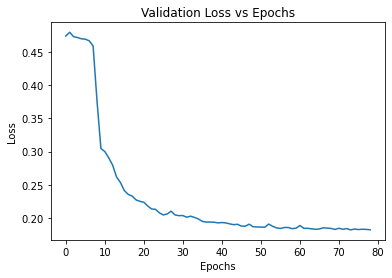
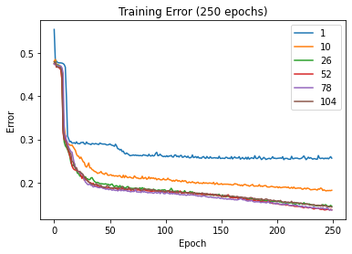
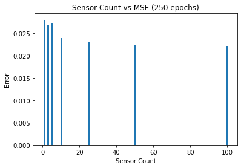
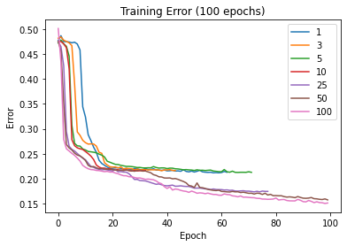

# Investigating the Performance of LSTM/Decoder Models for Sea-Surface Temperature Reconstruction

## Abstract
This Python code explores the performance of an LSTM/decoder model for sea-surface temperature reconstruction using the "pyshred" framework. The analysis involves varying the time lag variable, adding Gaussian noise to the data, and altering the number of sensors used for training. These modifications aim to understand the impact of these factors on the model's performance in terms of mean squared error between reconstructed and ground truth data. The LSTM/decoder model is created using PyTorch, and the data is processed with MinMaxScaler before being fed into SHRED. The input sequences are generated for each combination of time lag, noise level, and number of sensors for the model to train, validate, and reconstruct test datasets. The results of this study provide insights into the application of LSTM/decoder models in reconstructing sea-surface temperature data, which can be useful for understanding climate change, weather patterns, and ocean dynamics.

## Introduction

In this project, I investigate the effectiveness of an LSTM/decoder model for sea-surface temperature reconstruction using the "pyshred" framework developed by [Jan-Williams](https://github.com/Jan-Williams/pyshred). The main goal of the study is to analyze the performance of the model under various conditions, such as changes in the time lag variable, the addition of Gaussian noise to the data, and the variation in the number of sensors used for training the model. By performing these analyses, I aim to gain a deeper understanding of how the LSTM/decoder model is affected by these factors, which may shed light on potential improvements or limitations in its application to real-world problems.

To achieve these objectives, I first download the example code and data from the provided GitHub repository and train the LSTM/decoder model using PyTorch. I then preprocess the data using MinMaxScaler and generate input sequences to the "pyshred" model by considering different combinations of the time lag, noise level, and number of sensors. The trained model is then used to reconstruct the test datasets for each combination of these factors.

Next, I investigate the performance of the model in terms of the mean squared error between the reconstructed data and the ground truth data for each combination of the factors. By plotting the validation loss versus the number of epochs, I visualize the learning process of the model for different combinations.

Finally, I conduct separate analyses for the time lag variable, Gaussian noise level, and number of sensors to evaluate how each of these factors affects the model's performance. The results of these analyses can provide valuable insights into the potential applicability and performance of the LSTM/decoder model in reconstructing sea-surface temperature data, which has significant implications for understanding climate change, weather patterns, and ocean dynamics.

## Theoretical Background
Theoretical Background

In this project, the chosen LSTM/decoder model is at the core of the analysis aiming to reconstruct sea surface temperature data using the "pyshred" framework developed by Jan-Williams. LSTM stands for Long Short-Term Memory, a type of recurrent neural network (RNN) architecture that is particularly effective in processing sequences of data with long-term dependencies. Due to their ability to retain information over extended periods of time, LSTMs are suitable for time series data such as sea surface temperature measurements, providing an advantage over traditional feedforward neural networks lacking this capability.

The LSTM/decoder model consists of an encoder, which is responsible for transforming the input sequence into a fixed-length vector representation. This is achieved by processing the sequence through a series of LSTM cells with hidden states, retaining crucial information about the input data. Following this, the decoder takes the fixed-length vector output from the encoder and generates the reconstructed data by iteratively predicting the next element in the sequence based on its previous hidden state and the given fixed-length vector. In our study, the encoder and decoder parts of the model are designed as LSTM layers followed by fully connected layers, which enrich the model's learning capability.

In order to investigate the performance of the LSTM/decoder model under various conditions, our analyses focus on three key factors: the time lag variable, the addition of Gaussian noise to the data, and the number of sensors used for training the model. The time lag variable dictates the length of the considered input sequences, determining the amount of historical data used for predicting future values. This variable influences the ability of the LSTM/decoder model to capture and exploit long-term dependencies present in the time series data to construct accurate predictions.

Moreover, the presence of noise in the data affects the model's capacity to capture the true underlying patterns in the dataset, as training the model on noisy data might result in inaccurate predictions due to incorrect associations. To simulate this condition, Gaussian noise is added to the preprocessed input data to observe how the LSTM/decoder model's performance is influenced by varying degrees of noise. Lastly, the number of sensors used for training the model also plays a crucial role in determining its efficacy. With a higher number of sensors, the model has access to richer information, increasing its potential to capture more complex dependencies and patterns in the data.

In conclusion, the LSTM/decoder model serves as an appropriate choice to tackle the sea-surface temperature reconstruction problem due to its ability to handle time series data with long-term dependencies. By analyzing the model's performance under a range of conditions, this study aims to provide insights into the LSTM/decoder model's applicability and potential limitations in reconstructing sea-surface temperature data, which hold significant implications for understanding climate change, weather patterns, and ocean dynamics.

## Algorithm Analysis

### Problem I: SHRED Analysis

#### Part I: Import Required Libraries
```python
import numpy as np
from processdata import load_data
from processdata import TimeSeriesDataset
import models
import torch
import matplotlib.pyplot as plt
from sklearn.preprocessing import MinMaxScaler
import pandas as pd
```

#### Part II: Define Parameters and Import Data

The number of sensors and lag durations are set to 3 and 52 respectively. Next, the dataset is loaded and and sensor locations are randomly chosen with the `np.random.choice()` function

```python
num_sensors = 3 
lags = 52
load_X = load_data('SST')
n = load_X.shape[0]
m = load_X.shape[1]
sensor_locations = np.random.choice(m, size=num_sensors, replace=False)
```
#### Part III: Defining Train, Test, and Validation Datasets

Training, Test, and Validation datasets are created and scaled. The data is then converted into `torch tensors` and eventually `TimeSeriesDataset`

```python
train_indices = np.random.choice(n - lags, size=1000, replace=False)
mask = np.ones(n - lags)
mask[train_indices] = 0
valid_test_indices = np.arange(0, n - lags)[np.where(mask!=0)[0]]
valid_indices = valid_test_indices[::2]
test_indices = valid_test_indices[1::2]

sc = MinMaxScaler()
sc = sc.fit(load_X[train_indices])
transformed_X = sc.transform(load_X)

### Generate input sequences to a SHRED model
all_data_in = np.zeros((n - lags, lags, num_sensors))
for i in range(len(all_data_in)):
    all_data_in[i] = transformed_X[i:i+lags, sensor_locations]

### Generate training validation and test datasets both for reconstruction of states and forecasting sensors
device = 'cuda' if torch.cuda.is_available() else 'cpu'

train_data_in = torch.tensor(all_data_in[train_indices], dtype=torch.float32).to(device)
valid_data_in = torch.tensor(all_data_in[valid_indices], dtype=torch.float32).to(device)
test_data_in = torch.tensor(all_data_in[test_indices], dtype=torch.float32).to(device)

### -1 to have output be at the same time as final sensor measurements
train_data_out = torch.tensor(transformed_X[train_indices + lags - 1], dtype=torch.float32).to(device)
valid_data_out = torch.tensor(transformed_X[valid_indices + lags - 1], dtype=torch.float32).to(device)
test_data_out = torch.tensor(transformed_X[test_indices + lags - 1], dtype=torch.float32).to(device)

train_dataset = TimeSeriesDataset(train_data_in, train_data_out)
valid_dataset = TimeSeriesDataset(valid_data_in, valid_data_out)
test_dataset = TimeSeriesDataset(test_data_in, test_data_out)
```

#### Part IV: Training and Evaluating the Model

The shred model is trained over `100` epochs and evaluated using `mse`

```python
shred = models.SHRED(num_sensors, m, hidden_size=64, hidden_layers=2, l1=350, l2=400, dropout=0.1).to(device)
validation_errors = models.fit(shred, train_dataset, valid_dataset, batch_size=64, num_epochs=100, lr=1e-3, verbose=True, patience=5)

test_recons = sc.inverse_transform(shred(test_dataset.X).detach().cpu().numpy())
test_ground_truth = sc.inverse_transform(test_dataset.Y.detach().cpu().numpy())
print(np.linalg.norm(test_recons - test_ground_truth) / np.linalg.norm(test_ground_truth))
```

#### Part V: Visualizing the Data

The training loss from training is plotted on a time axis while differences between reconstructions and ground truths are plotted in a heat map

```python
plt.plot(validation_errors)
plt.title("Validation Loss vs Epochs")
plt.xlabel("Epochs")
plt.ylabel("Loss")
plt.show()
```


```python
recons_differences = test_recons - test_ground_truth
plt.imshow(recons_differences, aspect='auto', cmap='seismic')
plt.title("Differences between Reconstructions and Ground Truth")
plt.xlabel("Spatial Dimension")
plt.ylabel("Time Index")
plt.colorbar()
plt.show()
```


### Problem II: Impact of Lag, Noise, and Sensor Count on Model Performance

#### Part I: Lag 

A series of lag values are tested `[1, 10, 26, 52, 78, 104]` and their training error and final test error is visualized. The model is trained twice. The first set of training is identical to the Problem I with an `epoch` count of `50` and a patience value of `50`. The second set runs for `250` `epochs` does not consider `patience`
```python
lags_list = [1, 10, 26, 52, 78, 104]
mse_list = {}
errors = {}
for lags in lags_list:
    train_indices = np.random.choice(n - lags, size=1000, replace=False)
    mask = np.ones(n - lags)
    mask[train_indices] = 0
    valid_test_indices = np.arange(0, n - lags)[np.where(mask!=0)[0]]
    valid_indices = valid_test_indices[::2]
    test_indices = valid_test_indices[1::2]
    # (use the same code as before, updating the 'lags' variable)
    sc = MinMaxScaler()
    sc = sc.fit(load_X[train_indices])
    transformed_X = sc.transform(load_X)

    ### Generate input sequences to a SHRED model
    all_data_in = np.zeros((n - lags, lags, num_sensors))
    for i in range(len(all_data_in)):
        all_data_in[i] = transformed_X[i:i+lags, sensor_locations]

    ### Generate training validation and test datasets both for reconstruction of states and forecasting sensors
    device = 'cuda' if torch.cuda.is_available() else 'cpu'

    train_data_in = torch.tensor(all_data_in[train_indices], dtype=torch.float32).to(device)
    valid_data_in = torch.tensor(all_data_in[valid_indices], dtype=torch.float32).to(device)
    test_data_in = torch.tensor(all_data_in[test_indices], dtype=torch.float32).to(device)

    ### -1 to have output be at the same time as final sensor measurements
    train_data_out = torch.tensor(transformed_X[train_indices + lags - 1], dtype=torch.float32).to(device)
    valid_data_out = torch.tensor(transformed_X[valid_indices + lags - 1], dtype=torch.float32).to(device)
    test_data_out = torch.tensor(transformed_X[test_indices + lags - 1], dtype=torch.float32).to(device)

    train_dataset = TimeSeriesDataset(train_data_in, train_data_out)
    valid_dataset = TimeSeriesDataset(valid_data_in, valid_data_out)
    test_dataset = TimeSeriesDataset(test_data_in, test_data_out)

    # Train the model
    shred = models.SHRED(num_sensors, m, hidden_size=64, hidden_layers=2, l1=350, l2=400, dropout=0.1).to(device)
    validation_errors = models.fit(shred, train_dataset, valid_dataset, batch_size=64, num_epochs=100, lr=1e-3, verbose=True, patience=5)

    # Get the test reconstructions
    test_recons = sc.inverse_transform(shred(test_dataset.X).detach().cpu().numpy())
    test_ground_truth = sc.inverse_transform(test_dataset.Y.detach().cpu().numpy())

    # Calculate the mean squared error
    mse = np.linalg.norm(test_recons - test_ground_truth) / np.linalg.norm(test_ground_truth)
    mse_list[lags] = mse
    errors[lags] = validation_errors
```

MSE Plots

```python
plt.bar(lags_list, list(mse_list2.values()))
plt.xlabel("Lag Value")
plt.ylabel("Error")
plt.title("Lag vs MSE (100 epochs)")
plt.show()

plt.bar(lags_list, list(mse_list3.values()))
plt.xlabel("Lag Value")
plt.ylabel("Error")
plt.title("Lag vs MSE (250 epochs)")
plt.show()
```


Training Plots

```python
for i in lags_list:
    plt.plot(errors2[i], label=i)
plt.legend()
plt.xlabel("Epoch")
plt.ylabel("Error")
plt.title("Training Error (100 epochs)")

for i in lags_list:
    plt.plot(errors3[i], label=i)
plt.legend()
plt.xlabel("Epoch")
plt.ylabel("Error")
plt.title("Training Error (250 epochs)")
```




#### Part II: Noise

The exact same procedure as part I except noise levels are altered and added to the original `trainsformed_x` variable

```python
noise_levels = [0, .05, .1, .25, .5, 1]
mse_list_noise = {}
error_list_noise = {}
num_sensors = 3
lags = 52
load_X = load_data('SST')
n = load_X.shape[0]
m = load_X.shape[1]
sc = MinMaxScaler()
sc = sc.fit(load_X[train_indices])
sensor_locations = np.random.choice(m, size=num_sensors, replace=False)
transformed_X = sc.transform(load_X)

for noise_level in noise_levels:
    # Add Gaussian noise to the transformed data
    noisy_data = transformed_X + np.random.normal(0, noise_level, transformed_X.shape)
    ...

    # Modify the input generation and training/validation/test datasets for the noisy data
    # (use the same code as before, updating the 'all_data_in' definition)
    ...
    ### Generate input sequences to a SHRED model
    all_data_in = np.zeros((n - lags, lags, num_sensors))
    for i in range(len(all_data_in)):
        all_data_in[i] = noisy_data[i:i+lags, sensor_locations]

    ### Generate training validation and test datasets both for reconstruction of states and forecasting sensors
    device = 'cuda' if torch.cuda.is_available() else 'cpu'

    train_data_in = torch.tensor(all_data_in[train_indices], dtype=torch.float32).to(device)
    valid_data_in = torch.tensor(all_data_in[valid_indices], dtype=torch.float32).to(device)
    test_data_in = torch.tensor(all_data_in[test_indices], dtype=torch.float32).to(device)

    ### -1 to have output be at the same time as final sensor measurements
    train_data_out = torch.tensor(noisy_data[train_indices + lags - 1], dtype=torch.float32).to(device)
    valid_data_out = torch.tensor(noisy_data[valid_indices + lags - 1], dtype=torch.float32).to(device)
    test_data_out = torch.tensor(noisy_data[test_indices + lags - 1], dtype=torch.float32).to(device)

    train_dataset = TimeSeriesDataset(train_data_in, train_data_out)
    valid_dataset = TimeSeriesDataset(valid_data_in, valid_data_out)
    test_dataset = TimeSeriesDataset(test_data_in, test_data_out)

    # Train the model
    shred = models.SHRED(num_sensors, m, hidden_size=64, hidden_layers=2, l1=350, l2=400, dropout=0.1).to(device)
    validation_errors = models.fit(shred, train_dataset, valid_dataset, batch_size=64, num_epochs=100, lr=1e-3, verbose=True, patience=5)

    # Get the test reconstructions
    test_recons = sc.inverse_transform(shred(test_dataset.X).detach().cpu().numpy())
    test_ground_truth = sc.inverse_transform(test_dataset.Y.detach().cpu().numpy())

    # Calculate the mean squared error
    mse = np.linalg.norm(test_recons - test_ground_truth) / np.linalg.norm(test_ground_truth)
    mse_list_noise[noise_level] = mse
    error_list_noise[noise_level] = validation_errors
```

MSE Plots

```python
plt.bar(noise_levels, list(mse_list_noise2.values()))
plt.xlabel("Noise Value")
plt.ylabel("Error")
plt.title("Noise vs MSE (100 epochs)")
plt.show()

plt.bar(noise_levels, list(mse_list_noise3.values()))
plt.xlabel("Noise Value")
plt.ylabel("Error")
plt.title("Noise vs MSE (250 epochs)")
plt.show()
```


Training Plots

```python
for i in noise_levels:
    plt.plot(error_list_noise2[i], label=i)
plt.legend()
plt.xlabel("Epoch")
plt.ylabel("Error")
plt.title("Training Error (100 epochs)")
plt.show()

for i in noise_levels:
    plt.plot(error_list_noise3[i], label=i)
plt.legend()
plt.xlabel("Epoch")
plt.ylabel("Error")
plt.title("Training Error (250 epochs)")
plt.show()
```


#### Part III: Sensor Count

The exact same procedure as part I except sensor counts are altered before training

```python
num_sensors_list = [1, 3, 5, 10, 25, 50, 100]
mse_list_sensors = {}
error_list_sensors = {}

for num_sensors in num_sensors_list:
    lags = 52
    load_X = load_data('SST')
    n = load_X.shape[0]
    m = load_X.shape[1]
    sensor_locations = np.random.choice(m, size=num_sensors, replace=False)


    train_indices = np.random.choice(n - lags, size=1000, replace=False)
    mask = np.ones(n - lags)
    mask[train_indices] = 0
    valid_test_indices = np.arange(0, n - lags)[np.where(mask!=0)[0]]
    valid_indices = valid_test_indices[::2]
    test_indices = valid_test_indices[1::2]

    sc = MinMaxScaler()
    sc = sc.fit(load_X[train_indices])
    transformed_X = sc.transform(load_X)

    ### Generate input sequences to a SHRED model
    all_data_in = np.zeros((n - lags, lags, num_sensors))
    for i in range(len(all_data_in)):
        all_data_in[i] = transformed_X[i:i+lags, sensor_locations]

    ### Generate training validation and test datasets both for reconstruction of states and forecasting sensors
    device = 'cuda' if torch.cuda.is_available() else 'cpu'

    train_data_in = torch.tensor(all_data_in[train_indices], dtype=torch.float32).to(device)
    valid_data_in = torch.tensor(all_data_in[valid_indices], dtype=torch.float32).to(device)
    test_data_in = torch.tensor(all_data_in[test_indices], dtype=torch.float32).to(device)

    ### -1 to have output be at the same time as final sensor measurements
    train_data_out = torch.tensor(transformed_X[train_indices + lags - 1], dtype=torch.float32).to(device)
    valid_data_out = torch.tensor(transformed_X[valid_indices + lags - 1], dtype=torch.float32).to(device)
    test_data_out = torch.tensor(transformed_X[test_indices + lags - 1], dtype=torch.float32).to(device)

    train_dataset = TimeSeriesDataset(train_data_in, train_data_out)
    valid_dataset = TimeSeriesDataset(valid_data_in, valid_data_out)
    test_dataset = TimeSeriesDataset(test_data_in, test_data_out)
    # Modify the sensor locations and input generation accordingly
    ...

    # Train the model
    shred = models.SHRED(num_sensors, m, hidden_size=64, hidden_layers=2, l1=350, l2=400, dropout=0.1).to(device)
    validation_errors = models.fit(shred, train_dataset, valid_dataset, batch_size=64, num_epochs=100, lr=1e-3, verbose=True, patience=5)

    # Get the test reconstructions
    test_recons = sc.inverse_transform(shred(test_dataset.X).detach().cpu().numpy())
    test_ground_truth = sc.inverse_transform(test_dataset.Y.detach().cpu().numpy())

    # Calculate the mean squared error
    mse = np.linalg.norm(test_recons - test_ground_truth) / np.linalg.norm(test_ground_truth)
    mse_list_sensors[num_sensors] = mse
    error_list_sensors[num_sensors] = validation_errors
```

MSE Plots

```python
plt.bar(num_sensors_list, list(mse_list_sensors2.values()))
plt.xlabel("Sensor Count")
plt.ylabel("Error")
plt.title("Sensor Count vs MSE (100 epochs)")
plt.show()

plt.bar(num_sensors_list, list(mse_list_sensors3.values()))
plt.xlabel("Sensor Count")
plt.ylabel("Error")
plt.title("Sensor Count vs MSE (250 epochs)")
plt.show()
```




Training Plots

```python
for i in num_sensors_list:
    plt.plot(error_list_sensors2[i], label=i)
plt.legend()
plt.xlabel("Epoch")
plt.ylabel("Error")
plt.title("Training Error (100 epochs)")
plt.show()

for i in num_sensors_list:
    plt.plot(error_list_sensors3[i], label=i)
plt.legend()
plt.xlabel("Epoch")
plt.ylabel("Error")
plt.title("Training Error (250 epochs)")
plt.show()
```




## Computational Results

### Original SHRED Results


### Lag Results

**100 Epochs**

| Lag  | Error   |
|------|---------|
| 1    | 0.0526  |
| 10   | 0.0422  |
| 26   | 0.0395  |
| 52   | 0.0375  |
| 78   | 0.0352  |
| 104  | 0.0372  |


**250 Epochs**

| Lag | Error   |
|-----|---------|
| 1   | 0.0535  |
| 10  | 0.0345  |
| 26  | 0.0268  |
| 52  | 0.0251  |
| 78  | 0.0257  |
| 104 | 0.0261  |


### Noise Results

**100 Epochs**

| Noise | Error   |
|-------|--------|
| 0     | 0.0288 |
| 0.05  | 0.0347 |
| 0.1   | 0.0524 |
| 0.25  | 0.1167 |
| 0.5   | 0.2312 |
| 1     | 0.4338 |


**250 Epochs*

| Noise | Error  |
|-------|--------|
| 0     | 0.0364 |
| 0.05  | 0.0402 |
| 0.1   | 0.0559 |
| 0.25  | 0.1158 |
| 0.5   | 0.2192 |
| 1     | 0.4063 |


### Sensor Results

**100 Epochs**

| Sensors | Error  |
|---------|--------|
| 1       | 0.0280 |
| 3       | 0.0268 |
| 5       | 0.0273 |
| 10      | 0.0239 |
| 25      | 0.0229 |
| 50      | 0.0223 |
| 100     | 0.0221 |


**250 Epochs**

| Sensors | Error  |
|---------|--------|
| 1       | 0.0376 |
| 3       | 0.0363 |
| 5       | 0.0347 |
| 10      | 0.0369 |
| 25      | 0.0318 |
| 50      | 0.0294 |
| 100     | 0.0276 |


## Summary and Conclusion

In this study, I analyzed the performance of an LSTM/Decoder model, SHRED, on the sea-surface temperature dataset from the GitHub repository [pyshred](https://github.com/Jan-Williams/pyshred). I conducted evaluations with varying time lags, noise levels, and the number of sensors in the dataset, to study the model's performance under different circumstances.

### Time Lag Analysis

I observed that the mean squared error (MSE) decreases as the time lag value increases. This trend indicates that, for this specific problem, the model performs better when it is provided with more historical data. This result was consistent across both 100 and 250 epochs of training. The training error graph indicates the model converges faster for smaller lag values, which is expected due to the smaller computational complexity.

### Noise Analysis

The model's performance was also evaluated with varying levels of added Gaussian noise to the dataset. As the noise level was increased, the MSE increased as well, indicating that the model is more sensitive to inherently noisy datasets. The model's performance deteriorated significantly as the noise level increased from 0.25 to 1. Training error graphs indicate that the model has a harder time converging with higher noise levels, requiring more epochs to reach a satisfactory performance.

### Number of Sensors Analysis

The effect of varying the number of sensors on the model's performance was also assessed. The trend showed that the MSE generally decreased as the number of sensors increased, except in the transition from 1 to 3 sensors for both 100 and 250 epochs. This result suggests that the model benefits from having more input channels for this dataset. The training error graphs show that the model converges slower with a higher number of sensors, which is expected due to the increased computational complexity.

### Conclusion

Overall, the SHRED model exhibited good performance for the sea-surface temperature dataset with varying configurations. The analysis demonstrated the importance of considering the time lag, noise levels, and the number of sensors when designing and evaluating deep learning models, as these factors could significantly impact the model's performance and convergence during training. For the specific LSTM/Decoder model implemented in this study, providing more historical data and considering the noise levels for the input dataset could play a key role in enhancing the model's accuracy and efficiency in predicting sea-surface temperature data.
