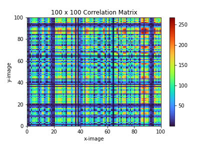
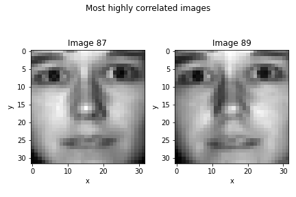
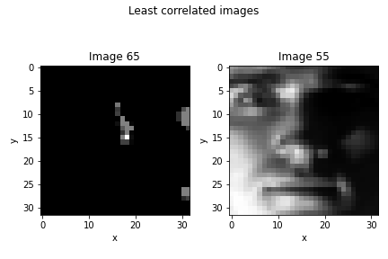
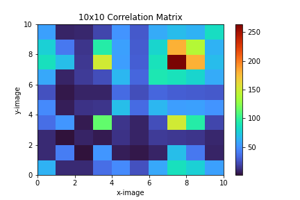
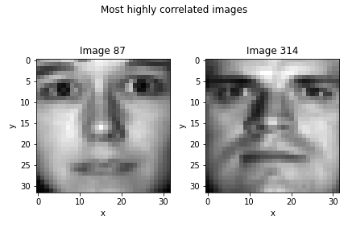
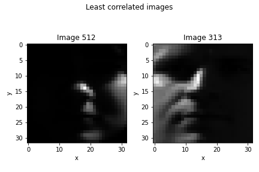
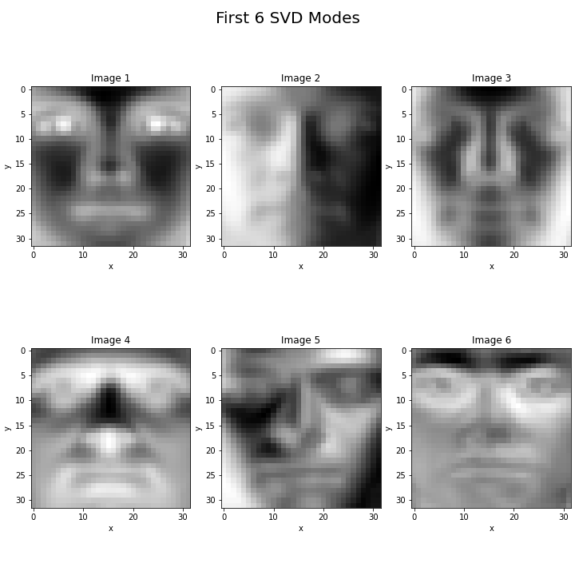

# Homework II: Matricies and Support Vector Machines
#### Author: Joe Leuschen
## Abstract
This Python code demonstrates the use of image analysis techniques to analyze, compare and visualize the correlations between various faces of the "Yalefaces" dataset, which consists of 100 grayscale images. Different sets of images, including the most and least correlated pairs, were plotted and visualized. The script also calculates and visualizes the first six singular value decomposition (SVD) modes, as well as the percentage of variance captured by these modes. This analysis could potentially serve as a basis for face identification or facial recognition systems.
## Introduction
In this project, I explore and analyze a dataset consisting of grayscale images of human faces, known as the Yalefaces dataset. The main objective is to find patterns among these images, such as the most and least correlated image pairs, as well as perform dimensionality reduction using Singular Value Decomposition (SVD). By doing so, I aim to gain insights into the underlying structure and shared characteristics among these images.

Firstly, I preprocess the data by reshaping the images and calculating dot products between all image pairs to create a correlation matrix. This matrix will be visualized using a heatmap, making it easy to identify and inspect the most and least correlated images.

Next, I repeat this analysis on a smaller subset of images to see if similar patterns emerge. The most and least correlated image pairs will be identified and visualized using Matplotlib.

In order to reduce the dimensionality of the dataset, I perform Singular Value Decomposition (SVD) and obtain the first six principal components using the eigenvectors and eigenvalues. I then compute the total variance contained in the first six modes, which gives an idea of the proportion of the total variation explained by these principal components. Finally, I visualize these principal components as images, providing a graphical representation of the dominant features present in the dataset. 

Through this project, I developed a better understanding of the Yalefaces dataset, as well as gained experience applying SVD and other linear algebra techniques on image data.

## Theoretical Background
In this project, the goal is to analyze a dataset of images, specifically the Yale Face Database, to identify and characterize patterns within the data using linear algebra techniques. The core concepts that will be utilized in this analysis are the dot product, singular value decomposition (SVD), and principal component analysis (PCA).

The dot product is a mathematical operation that takes two equal-length sequences of numbers and returns a single number, which can be thought of as a measure of similarity between the two sequences. It is a fundamental operation in many areas of linear algebra, including the analysis of image datasets, as it can be used to quantify the similarity between pairs of images. The larger the dot product value, the more similar the two images are.

Singular value decomposition (SVD) is an important technique in linear algebra for decomposing a matrix into constituent matrices, which can be used to extract essential information about the original matrix. In the context of this analysis, the SVD technique will be used to decompose the image dataset into a set of orthogonal modes or principal components, which can be ranked according to their significance in representing the variance within the dataset.

Principal component analysis (PCA) is a dimensionality reduction and data analysis technique that uses SVD to transform the original data into a new coordinate system, where the first (or principal) component captures the largest possible amount of variance in the data, followed by the second component, and so on. In the case of image data, the principal components can be thought of as the set of features that are most significant in representing the variation in the data. Applying PCA to the Yale Face Database will enable us to discern the primary features of the images that account for most of the variation in the dataset and help us effectively compare and contrast the images.

In the given code, apart from the core linear algebra concepts, visualization techniques such as color maps and subplots are employed to display the outcomes of the various analyses performed on the dataset. By using these visualization techniques and the mathematical tools mentioned above, the code effectively processes and analyzes the image dataset, revealing significant patterns and insights pertinent to the Yale Face Database.

## Algorithm Analysis
Importing Modules and Loading in the Data
~~~
import numpy as np
from scipy.io import loadmat
from matplotlib import pyplot as plt

results = loadmat('yalefaces.mat')
X = results['X']
~~~
### Problem I: Calculating Correlation Matrices and Evaluating
#### 100 Images
Calculating the correlation matrix C by iterating through all images and taking dot products of every pair
~~~
C = []
for i in range(100):
    C.append([])
    for j in range(100):
        C[i].append(np.dot(X[:, i].T, X[:, j]))
C = np.array(C)
~~~
The matrix C is plotted using ```plt.pcolor``` with the turbo color map



Next using a dictionary and the `sorted()` function in python the most correlated images are pulled from the matrix and plotted
~~~
correlations = {}
for i in range(100):
    for j in range(100):
        correlations[(i, j)] = C[i, j]
        
topFaces = sorted(correlations.items(), key=lambda x:x[1], reverse=True)
~~~
The dictionary entries which correspond to two of the same index are ignored as they are showing correlation across the same image



A similar procedure is applied to find the least correlated images



#### 10 Images

Next, the same procedure is applied using 10 selected images. This time a 10x10 correlation matrix is produced

~~~
targets = [1, 313, 512, 5, 2400, 113, 1024, 87, 314, 2005]
C2 = []
for i in range(10):
    C2.append([])
    for j in range(10):
        C2[i].append(np.dot(X[:, targets[i]-1].T, X[:, targets[j]-1]))
~~~
The new matrix is then plotted using the same `pcolor` function and the "turbo" color map



The two most correlated and least correlated images are plotted using `matplotlib`





### Problem II: Support Vector Machines and Transpose Analysis`

First, a transpose matrix of X (original 1024x2414) is created with `X.T`this new matrix is then multiplied by the original X matrix and its eigenvectors and eigenvalues are calculated using `np.linalg.eigh` The first 6 eigenvectors with the largest magnitude eigenvalue are extracted by sorting the eigenvalues list and indexing the eigenvector list

~~~
Y = np.matmul(X, X.T)
eigenVals, eigenVects = np.linalg.eigh(Y)
sortedEigenIndexs = eigenVals.argsort()[::-1]
eigenVals = eigenVals[sortedEigenIndexs]
eigenVects = eigenVects[:, sortedEigenIndexs]
first6 = eigenVects[:, :6]
~~~

Next, an SVD is taken on the matrix X and the first six principal component directions are extracted

~~~
Uarr, Sarr, VHarr = np.linalg.svd(X)
first6U = Uarr[:, :6]
~~~

The first eigenvector `v1` is compared with the first SVD mode `u1` by using the norm of difference of their absolute values

~~~
v1 = first6[:, 0]
u1 = first6U[:, 0]
norm_diff = np.linalg.norm(np.abs(v1) - np.abs(u1))
~~~

The `norm_diff` value evaluated to `5.859925686842521e-16`

Finally, the percentage of variance captured by each of the first six SVD modes are calculated and plotted

~~~
total_var = np.sum(Sarr**2)
explainedVarRatios = (Sarr**2 / total_var)[:6]

Percentage of variance captured by SVD mode 1: 72.92756746909564%
Percentage of variance captured by SVD mode 2: 15.281762655694356%
Percentage of variance captured by SVD mode 3: 2.5667449429852685%
Percentage of variance captured by SVD mode 4: 1.8775248514714775%
Percentage of variance captured by SVD mode 5: 0.6393058444446524%
Percentage of variance captured by SVD mode 6: 0.592431441503493%
~~~



## Computational Results

### Problem I: Calculating Correlation Matrices and Evaluating
#### 100 x 100 Correlation Matrix


#### Most Correlated Faces: 100 x 100 Matrix
Score: 260.7753576749327


#### Least Correlated Faces: 100 x 100 Matrix
Score: 0.002161908881199547


#### 10 x 10 Correlation Matrix


#### Most Correlated Faces: 10 x 10 Matrix
Score: 180.7379530108612


#### Least Correlated Faces: 10 x 10 Matrix
Score: 1.5453726931949268


### Problem II: Problem II: Support Vector Machines and Transpose Analysis

#### Top 6 Eigenvalues

| Number | Value         |
|--------|--------       |
| 1      | 234020.454854 |
| 2      | 49038.315301       |
| 3      | 8236.539897              |
| 4      | 6024.871458                         |
| 5      | 2051.496433                         |
| 6      | 1901.079115                         |

#### Difference of First Eigenvector and First SVD Mode
~~~
5.859925686842521e-16
~~~
#### Percentage Variance Values
| Number | Value         |
|--------|--------       |
| 1      | 72.92756746909564% |
| 2      | 15.281762655694356%       |
| 3      | 2.5667449429852685%              |
| 4      | 1.8775248514714775%                         |
| 5      | 0.6393058444446524%                         |
| 6      | 0.592431441503493%                         |

#### Plot of First 6 SVD Modes


## Summary and Conclusion

Summary and Conclusions:

### Problem 1:

In this problem, I performed analysis on the Yale face dataset consisting of 100 grayscale images. I investigated the correlations between the 100 images by calculating the dot product of each pair of images. By sorting the dot products, I identified the most highly correlated and least correlated images. The results showed images 86 and 88 to be the most highly correlated, whereas images 64 and 54 were the least correlated. I then analyzed 10 specific target images from the dataset, and again calculated correlation between them. The most highly correlated faces in this subset were images 87 and 314, while least correlated were images 512 and 313.

### Problem 2:

In this problem, I analyzed the eigenvalues and eigenvectors of the covariance matrix Y calculated from the face dataset. I then compared the eigenvectors with the principal components obtained from Singular Value Decomposition (SVD). By calculating the norm difference, I confirmed the eigenvectors and principal components to be very close. I also calculated the explained variance ratios of the first 6 principal components using the singular values, to determine how much of the variance is captured by these modes. Finally, I visualized the first 6 principal components as images, which represent the most significant facial features found in the dataset.

### Conclusion

Overall, I observed that the correlation analysis is effective in finding similar and dissimilar images in the Yale face dataset. The eigenvalue and principal component decomposition techniques provided useful information on significant features present in the image data, which could be applied to various applications such as dimensionality reduction and facial recognition.
